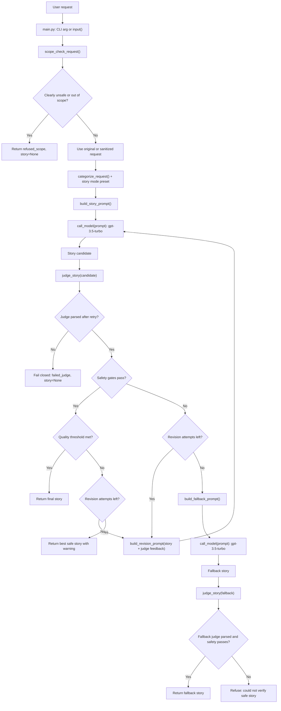

# Bedtime Story Agent Implementation Plan

## Summary

This project implements a small bedtime story agent for ages 5 to 10. It keeps
the assignment's required OpenAI model, `gpt-3.5-turbo`, while adding a
storyteller prompt, structured LLM judge, deterministic safety and quality
gates, bounded revision loop, safe fallback, debug metadata, and mocked tests.

The assignment `README.md` is intentionally left unchanged. This file documents
the implementation plan, architecture, and demo flow.

## File Layout

- `main.py`: thin command-line wrapper.
- `story_agent.py`: story pipeline, prompts, judge, revision loop, fallback, and result object.
- `tests/test_story_agent.py`: mocked unit tests that do not call OpenAI.
- `requirements.txt`: Python dependency list.
- `IMPLEMENTATION_PLAN.md`: design notes and block diagram.

## User Flow

1. User provides a story request by CLI argument or interactive input.
2. The request is checked for clear out-of-scope content.
3. Mildly risky wording is sanitized, but normal output does not mention it.
4. The request is categorized into a story mode preset.
5. The storyteller generates a story candidate.
6. The judge returns strict JSON.
7. Python code checks safety first, then quality.
8. The story is revised up to two times if needed.
9. If safety still fails, a simple known-safe fallback story is generated and judged once.
10. If safety cannot be verified, no story is returned.

## Block Diagram



## Safety and Quality Policy

Scope rejection is conservative. The tool accepts weird but harmless prompts,
such as a ninja robot in space. It refuses only clearly incompatible requests:
violent horror, sexual content, medical advice, crime concealment, or dangerous
instructions. Mild risk is sanitized instead of refused.

The judge returns strict JSON:

```json
{
  "age_appropriate": true,
  "safe_for_bedtime": true,
  "no_unsafe_content": true,
  "follows_request": true,
  "has_story_arc": true,
  "appropriate_length": true,
  "language_score": 4,
  "creativity_score": 4,
  "bedtime_score": 5,
  "overall_score": 4.3,
  "issues": [],
  "revision_instructions": "Make the ending warmer and calmer."
}
```

Python computes pass/fail deterministically:

- Safety passes only when `age_appropriate`, `safe_for_bedtime`, and
  `no_unsafe_content` are all true.
- Quality passes only when `follows_request`, `has_story_arc`, and
  `appropriate_length` are true, all numeric scores are at least 4, and
  `overall_score` is at least 4.
- The judge's prose is used only for revision guidance.
- If judge JSON is invalid, the judge is retried once with stricter JSON-only
  instructions. If that still fails, the system fails closed.

## Story Mode Presets

- `calming_bedtime`: slower pacing, soft imagery, peaceful ending.
- `friendship`: conflict-resolution arc.
- `learning`: one gentle concept learned through action.
- `adventure`: exciting but non-scary, with a calm return.
- `general`: classic bedtime beginning, middle, and end.

## Usage

Install dependencies:

```powershell
pip install -r requirements.txt
```

Set the API key:

```powershell
$env:OPENAI_API_KEY="your-key-here"
```

Run:

```powershell
python main.py "Tell me a bedtime story about a sleepy dragon"
python main.py --debug "Tell me a spooky story about a dragon in a scary forest"
python main.py
```

Normal output shows only the story or a refusal/error. Debug output includes
status, attempts, warnings, final judgment, sanitization metadata, and attempt
history.

## Tests

Run:

```powershell
python -m unittest discover -s tests
```

The tests use a mocked model client and never require `OPENAI_API_KEY`.


## Future Improvements Given More Time

Given more time, I would expand this project from a simple command-line bedtime story generator into a richer interactive storytelling platform for children and parents.

One feature I would love to add is image generation. Children are often most engaged by pictures, colors, and visual characters, so generating a simple illustration or cover image alongside each story could make the experience feel much more magical. For example, after the story is generated and judged as safe, the system could create a child-friendly image prompt describing the main character, setting, and mood of the story. A future version could then use an image generation model to produce a cozy bedtime illustration. This would make the tool feel less like a text generator and more like a personalized picture book.

I would also turn the project into a small hosted chat platform instead of only a CLI script. A web-based interface would let a parent or child ask for changes, such as “make it funnier,” “make the dragon smaller,” or “add my dog into the story.” The same judge-and-revision loop could run behind the scenes after every interaction to make sure the story remains age-appropriate, calming, and high quality.

Another future direction would be improving the storyteller model’s style. With access to properly licensed or public-domain children’s books, I would experiment with training or fine-tuning on a small curated subset of high-quality bedtime stories. The goal would not be to copy existing books, but to help the model better learn pacing, tone, vocabulary, story arcs, and the kind of gentle emotional resolution that works well for ages 5 to 10.

Finally, I would add more personalization. Parents could specify preferences like story length, reading level, recurring characters, moral lessons, or themes to avoid. Over time, the system could remember which kinds of stories a child enjoys and generate safer, warmer, and more engaging bedtime stories tailored to them.