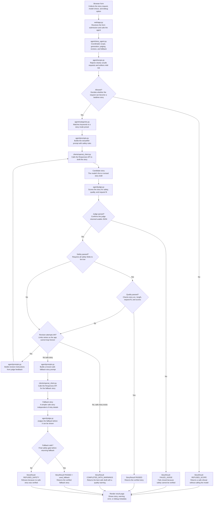

# Bedtime Story Agent Implementation Plan

## Summary

This project is a Flask web app for generating bedtime stories for children ages
5 to 10. The browser UI is the primary user interface. The backend keeps the
assignment's default `gpt-3.5-turbo` model, offers `gpt-4o-mini` as an optional
alternate model, uses the OpenAI Responses API, judges generated stories,
revises weak drafts, and falls back to a known-safe story path when needed.

The code is organized as a small package so the web layer, agent logic, OpenAI
client, and shared domain types are separate.

## Current File Layout

- `main.py`: local development entry point; creates and runs the Flask app.
- `bedtime_story_agent/web/`: Flask routes, HTML template, and CSS.
- `bedtime_story_agent/agent/`: story orchestration, scope checks, categories, prompts, and judge logic.
- `bedtime_story_agent/clients/`: OpenAI Responses API client.
- `bedtime_story_agent/domain/`: constants, enums, dataclasses, and judge schema.
- `tests/`: mocked unit tests for the agent and Flask routes.
- `pyproject.toml`: `uv` project configuration.
- `requirements.txt`: compatibility dependency list.

## Current User Flow

1. User opens the Flask web page.
2. User enters a bedtime story request.
3. User selects `gpt-3.5-turbo` or `gpt-4o-mini`.
4. Flask calls `run_story_agent(...)`.
5. The request is checked for out-of-scope or unsafe content.
6. Safe requests are categorized into a story mode preset.
7. The storyteller prompt is sent through the OpenAI Responses API.
8. The generated story is judged.
9. If safety and quality pass, the story is rendered.
10. If quality fails and attempts remain, the story is revised and judged again.
11. If safety cannot pass after revisions, the fallback story path is tried.
12. If the fallback also cannot be verified as safe, the app refuses to return a story.

## Block Diagram



## Safety and Quality Policy

Scope rejection is conservative. The app accepts weird but harmless prompts,
such as a ninja robot in space. It refuses clearly incompatible requests:
violent horror, sexual content, medical advice, crime concealment, or dangerous
instructions. Mild risk can be sanitized instead of refused.

The judge checks:

- Safety: `age_appropriate`, `safe_for_bedtime`, `no_unsafe_content`
- Quality: `follows_request`, `has_story_arc`, `appropriate_length`
- Scores: `language_score`, `creativity_score`, `bedtime_score`, `overall_score`

Safety must pass before any story is returned. Quality must meet threshold for a
clean pass. If the judge response cannot be parsed after retry, the system fails
closed.

## Model and Judge Behavior

- `gpt-3.5-turbo` remains the default model.
- `gpt-4o-mini` is available from the web UI as an alternate.
- All OpenAI calls go through the Responses API.
- The judge uses structured-output schema formatting for models listed in
  `STRUCTURED_OUTPUT_MODELS`.
- The default model keeps the strict JSON parse/retry path for compatibility.

## Redundancy Review

The current codebase is reasonably separated, but a few redundancies remain:

- `pyproject.toml` and `requirements.txt` both list dependencies. This is
  intentional for now: `uv` is the documented path, while `requirements.txt`
  remains a compatibility fallback.
- `README.md` and this file both describe setup and architecture. This is useful
  for a takehome, but the README should remain the source for user instructions
  and this file should remain the source for design explanation.
- Model validation happens in both `web/app.py` and `agent/story_agent.py`. This
  is defensive: the web layer protects form input, while the agent protects
  direct Python calls and tests.
- Judge schema constraints and `parse_judgment(...)` validation overlap. This is
  intentional because structured outputs are only used for selected models; the
  parser still protects the strict JSON fallback path.
- `run_story_agent(debug=...)` accepts `debug` but does not branch on it. The
  agent always collects debug metadata, and the web layer decides whether to
  render it.

No duplicate story-generation pipeline remains after the package split. The CLI
input path has been removed from the main user flow, and the previously unused
`is_good_enough(...)` helper was removed.

## Usage

Install dependencies:

```powershell
uv sync
```

Set the API key:

```powershell
$env:OPENAI_API_KEY="your-key-here"
```

Run the app:

```powershell
uv run python main.py
```

Open the local Flask URL, usually `http://127.0.0.1:5000`.

## Tests

Run:

```powershell
uv run python -m unittest discover -s tests
```

The tests use mocked model clients and do not require `OPENAI_API_KEY`.

## Future Improvements
Given more time, the next useful product improvements would focus on making the system more usable for parents while preserving the safety-first design. Parents could be given controls for story length, reading level, theme preferences, and tone, allowing them to request a short calming bedtime story, a more adventurous story, or a version appropriate for a specific age range. These controls would make the product feel less like a one-shot generator and more like a flexible storytelling assistant that can adapt to different children, routines, and family preferences.

Another important improvement would be support for follow-up revision requests. For example, after receiving a story, a parent might ask for it to be made shorter, less scary, more humorous, more educational, or more focused on a specific moral lesson. These revisions should still pass through the same judge pipeline rather than bypassing safety checks, since a safe first draft could become unsafe or lower quality after edits. This would extend the current storyteller-judge loop into a more interactive product workflow.

A later version could also generate a safe illustration prompt after the story passes the judge. Instead of directly generating an image from the original user request, the system would first validate the story and then produce an image prompt based only on the approved story content. This would reduce the risk of unsafe or inappropriate visual content while enabling a richer bedtime experience. Over time, the system could also store lightweight parent preferences, such as preferred story length or recurring themes, so repeat usage feels more personalized without compromising safety.
