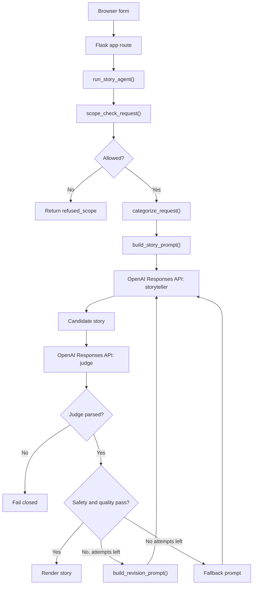

# Bedtime Story Agent

A small Flask web app that generates bedtime stories for children ages 5 to 10.
The app uses a storyteller prompt, an LLM judge, deterministic safety and
quality gates, bounded revisions, and a safe fallback path.

The default model remains `gpt-3.5-turbo` to respect the original assignment
constraint. The web UI also offers `gpt-4o-mini` as an alternate model; newer
models can use the structured-output judge path more reliably, while the
default model keeps a strict JSON parsing fallback.

## Setup

Install dependencies with `uv`:

```powershell
uv sync
```

Set your OpenAI API key:

```powershell
$env:OPENAI_API_KEY="your-key-here"
```

Run the web app:

```powershell
uv run python main.py
```

Open the local URL shown by Flask, usually:

```text
http://127.0.0.1:5000
```

## Usage

1. Enter a bedtime story request in the browser form.
2. Choose `gpt-3.5-turbo` or `gpt-4o-mini`.
3. Submit the form.
4. Read the generated story, warnings, and optional debug details.

The browser UI is the primary interaction path. `main.py` starts the Flask app;
the project no longer asks for user story input through `input()` or positional
CLI arguments.

## Architecture



## Code Layout

- `main.py`: starts the Flask web app.
- `bedtime_story_agent/web/`: Flask routes, templates, and CSS.
- `bedtime_story_agent/agent/`: story orchestration, prompts, categories, judge, and scope checks.
- `bedtime_story_agent/clients/`: external service clients, currently OpenAI.
- `bedtime_story_agent/domain/`: constants, enums, dataclasses, and judge schema.
- `tests/`: mocked unit tests.

## Safety and Quality Policy

The app accepts weird but harmless prompts, such as a ninja robot in space. It
refuses clearly incompatible requests such as violent horror, sexual content,
medical advice, crime concealment, or dangerous instructions. Mildly risky
wording can be softened before generation.

The judge checks:

- safety fields: `age_appropriate`, `safe_for_bedtime`, `no_unsafe_content`
- quality fields: `follows_request`, `has_story_arc`, `appropriate_length`
- numeric scores: `language_score`, `creativity_score`, `bedtime_score`, `overall_score`

If safety cannot be verified, the app fails closed and does not return the
story.

## Tests

Run the test suite:

```powershell
uv run python -m unittest discover -s tests
```

The tests use mocked model clients and do not require `OPENAI_API_KEY`.
